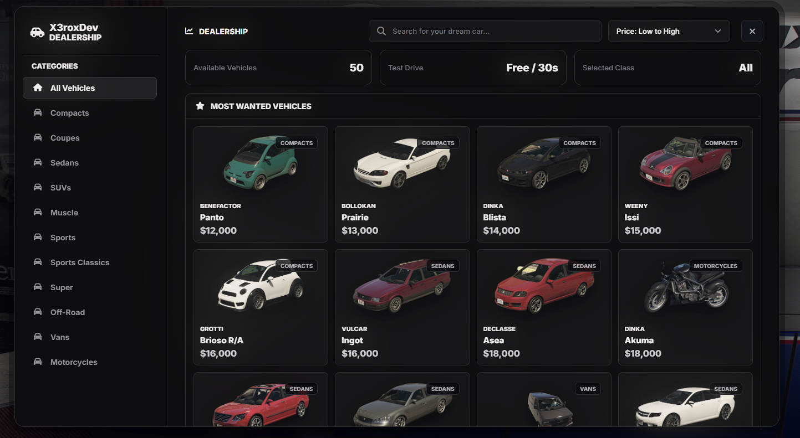

# Dealership

FiveM vehicle shop with ESX/QBCore support, interactive NUI, vehicle catalog images, test drives, and localization.

## Preview



## Features

- Vehicle shop NUI with categories, images, prices, and details
- ESX and QBCore framework bridge
- Configurable shop location, camera, spawn point, and test drive behavior
- Localized text files for English and Portuguese
- Server-side purchase validation
- Included vehicle image catalog with fallback asset

## Quick Start

```cfg
ensure es_extended
ensure dealership
```

```cfg
ensure qb-core
ensure dealership
```

1. Place `dealership` in your server `resources` folder.
2. Select your framework and configure shop settings in `config.lua`.
3. Review vehicle models, labels, brands, prices, categories, and image filenames.
4. Add the matching `ensure` lines to `server.cfg`.

## Configuration

Use `config.lua` for framework selection, currency/account behavior, shop coordinates, test drive settings, vehicle catalog, categories, and UI options. Translations live in `locales/`.

## Notes

Use the `ensure` block for your framework only. Verify every configured vehicle model can spawn on your server before players can purchase it.
